# Entity Relationship Diagram (ERD)

This document contains the visual relational model of the `pce_management` database. You can view this directly in any markdown viewer supporting Mermaid syntax.

```mermaid
erDiagram
    ROLES {
        int id PK
        varchar name
        varchar description
        timestamp created_at
        timestamp updated_at
    }

    USERS {
        int id PK
        int role_id FK
        varchar full_name
        varchar email
        varchar password
        enum status
        timestamp created_at
        timestamp updated_at
    }

    APPLICATIONS {
        int id PK
        varchar full_name
        varchar father_husband_name
        varchar cnic UK
        date dob
        enum gender
        varchar mobile_no
        varchar whatsapp_no
        varchar email
        varchar qualification
        varchar institute
        int passing_year
        varchar occupation_designation
        varchar organization_school_name
        text office_address
        text residential_address
        enum district
        varchar tehsil
        enum status
        text officer_remarks
        int reviewed_by FK
        datetime reviewed_at
        timestamp created_at
        timestamp updated_at
    }

    MEMBERS {
        int id PK
        varchar membership_id UK
        int application_id FK,UK
        int user_id FK,UK
        varchar full_name
        varchar father_husband_name
        varchar cnic UK
        date dob
        enum gender
        varchar mobile_no
        varchar whatsapp_no
        varchar email
        varchar qualification
        varchar institute
        int passing_year
        varchar occupation_designation
        varchar organization_school_name
        text office_address
        text residential_address
        enum district
        varchar tehsil
        enum status
        datetime activated_at
        timestamp created_at
        timestamp updated_at
    }

    DOCUMENTS {
        int id PK
        int application_id FK
        int member_id FK
        enum document_type
        varchar file_path
        varchar file_name
        int file_size
        varchar mime_type
        int uploaded_by FK
        timestamp created_at
        timestamp updated_at
    }

    CHALLANS {
        int id PK
        varchar challan_number UK
        int application_id FK
        int member_id FK
        decimal total_amount
        date due_date
        enum status
        text qr_code_data
        varchar pdf_file_path
        timestamp created_at
        timestamp updated_at
    }

    DUES_RECORDS {
        int id PK
        int application_id FK
        int member_id FK
        int challan_id FK
        enum dues_type
        varchar period
        decimal amount
        decimal paid_amount
        enum status
        date due_date
        timestamp created_at
        timestamp updated_at
    }

    PAYMENTS {
        int id PK
        int challan_id FK
        enum payment_method
        varchar transaction_ref UK
        int receipt_document_id FK
        decimal amount_paid
        date payment_date
        enum verification_status
        int verified_by FK
        datetime verified_at
        text rejection_reason
        timestamp created_at
        timestamp updated_at
    }

    ACCOUNT_CATEGORIES {
        int id PK
        varchar name UK
        enum type
        varchar description
        timestamp created_at
        timestamp updated_at
    }

    TRANSACTIONS {
        int id PK
        int category_id FK
        int challan_id FK
        int payment_id FK
        enum type
        decimal amount
        date transaction_date
        varchar reference_no
        text description
        int created_by FK
        timestamp created_at
        timestamp updated_at
    }

    NOTIFICATIONS_LOG {
        int id PK
        int user_id FK
        int member_id FK
        int application_id FK
        enum channel
        varchar recipient
        varchar subject
        text body
        enum status
        text error_message
        datetime sent_at
        timestamp created_at
    }

    AUDIT_LOG {
        int id PK
        int user_id FK
        varchar action
        varchar entity_name
        int entity_id
        json old_values
        json new_values
        varchar ip_address
        varchar user_agent
        timestamp created_at
    }

    SETTINGS {
        int id PK
        varchar setting_key UK
        text setting_value
        varchar description
        varchar category
        int updated_by FK
        timestamp updated_at
    }

    %% Relationships
    ROLES ||--o{ USERS : "assigned_to"
    USERS ||--o{ APPLICATIONS : "reviews"
    APPLICATIONS ||--o| MEMBERS : "transforms_into"
    USERS ||--o| MEMBERS : "provides_portal_to"

    APPLICATIONS ||--o{ DOCUMENTS : "attaches"
    MEMBERS ||--o{ DOCUMENTS : "attaches"
    USERS ||--o{ DOCUMENTS : "uploads"

    APPLICATIONS ||--o{ CHALLANS : "issued_to"
    MEMBERS ||--o{ CHALLANS : "issued_to"

    APPLICATIONS ||--o{ DUES_RECORDS : "debited_to"
    MEMBERS ||--o{ DUES_RECORDS : "debited_to"
    CHALLANS ||--o{ DUES_RECORDS : "bills"

    CHALLANS ||--o{ PAYMENTS : "paid_by"
    DOCUMENTS ||--|| PAYMENTS : "acts_as_receipt"
    USERS ||--o{ PAYMENTS : "verifies"

    ACCOUNT_CATEGORIES ||--o{ TRANSACTIONS : "classifies"
    CHALLANS ||--o{ TRANSACTIONS : "reconciles"
    PAYMENTS ||--o{ TRANSACTIONS : "records"
    USERS ||--o{ TRANSACTIONS : "authorizes"

    USERS ||--o{ NOTIFICATIONS_LOG : "notifies"
    MEMBERS ||--o{ NOTIFICATIONS_LOG : "notifies"
    APPLICATIONS ||--o{ NOTIFICATIONS_LOG : "notifies"

    USERS ||--o{ AUDIT_LOG : "triggers"
    USERS ||--o{ SETTINGS : "configures"
```

